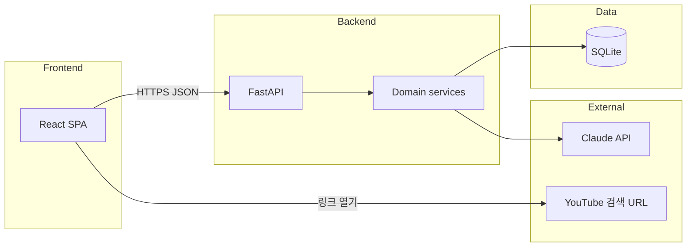

# 바텐더 — 시스템 아키텍처

> 기술 스택 요약은 [features.md](./features.md)를 따릅니다.

---

## 목표

1인가구 사용자에게 **AI 바텐더 대화**와 **식생활·음주 추천**을 제공하고, **테이스팅 노트·스트릭**으로 루틴을 만든다.

---

## 논리 구성

- **Frontend:** React + Vite + TypeScript, Tailwind. 라우팅으로 홈·채팅·추천·냉장고·노트 화면 분리.  
- **Backend:** FastAPI가 REST 엔드포인트 제공([api.md](./api.md)).  
- **AI:** 인사·채팅·추천·레시피·노트 코멘트·취향 분석·주간 코멘트 등은 Claude API(`claude-haiku-4-5`)로 생성.  
- **DB:** 노트·스트릭 등 영구 데이터([db-schema.md](./db-schema.md)).  
- **음악:** 별도 스트리밍 API 없이 **YouTube 검색 URL**만 조합해 프론트에서 열기.

---

## 주요 데이터 흐름

### 인사·추천·채팅(무상태 기본)

1. 클라이언트가 입력(또는 빈 인사 요청)을 전송한다.  
2. API가 프롬프트를 구성해 Claude를 호출한다.  
3. 응답 JSON을 규격에 맞게 파싱·반환한다.  
4. 채팅은 세션별 메시지 배열을 서버에서 유지하지 않아도 된다(클라이언트에서 이전 메시지를 같이 보내는 방식).

### 테이스팅 노트

1. `POST /api/notes` 시 본문을 DB에 저장한다.  
2. 저장 후 짧은 `bartender_comment` 생성을 위해 Claude 호출(또는 동기·비동기 정책은 구현에서 결정).

### 스트릭·주간 리포트

1. 일일 진입 또는 전용 엔드포인트에서 `user_streaks` 갱신.  
2. `GET /api/report/weekly`는 노트·방문 요약 문자열과 바텔더 코멘트를 Claude로 생성 가능.

---

## 비기능(해커톤 범위)

| 항목 | 방향 |
|------|------|
| 배포 | 정적 프론트 + 단일 FastAPI 프로세스 등 단순 구성 가능 |
| 인증 | 초기에는 생략 가능; 사용자 1명 고정이면 FK만 유지 |
| 비밀키 | Claude API 키는 서버 환경 변수만 사용, 클라이언트에 두지 않음 |
| 과음 안내 | 프롬프트 + 간단 한 키워드 검출 등으로 소프트 가드 |

---

## 관련 문서

| 문서 | 내용 |
|------|------|
| [api.md](./api.md) | 엔드포인트별 계약 |
| [db-schema.md](./db-schema.md) | 저장 모델 |
| [screens.md](./screens.md) | 화면별 API 사용 |
