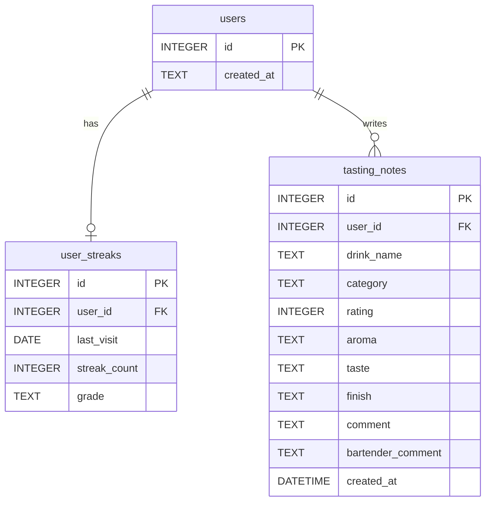

# 바텐더 — DB 스키마

> 엔티티 요약과 API 목록은 [features.md](./features.md)에 있습니다. 본 문서는 테이블·관계를 정규화해 기술합니다.

**선택 스택:** SQLite + SQLAlchemy ([features.md](./features.md) 기술 스택).

---

## 개요 다이어그램

해커톤에서 단일 사용자만 쓰는 경우 `users`에 행 하나를 두고 모든 FK를 그에 맞춥니다.

---

## `users`

| 컬럼 | 타입 | 제약 | 설명 |
|------|------|------|------|
| `id` | INTEGER | PK, AUTOINCREMENT | 사용자 식별자 |
| `created_at` | TEXT/DATETIME | NOT NULL, DEFAULT | ISO 8601 권장 |

프로필 닉네임 등은 추후 컬럼 추가.

---

## `user_streaks`

[features.md](./features.md)의 `UserStreak`에 `user_id`를 추가한 형태.

| 컬럼 | 타입 | 제약 | 설명 |
|------|------|------|------|
| `id` | INTEGER | PK | |
| `user_id` | INTEGER | FK → `users.id`, UNIQUE | 사용자당 1행 |
| `last_visit` | DATE | | 마지막 방문일 |
| `streak_count` | INTEGER | NOT NULL, DEFAULT 0 | 연속 방문 일수 |
| `grade` | TEXT | NOT NULL | 첫방문/단골/단골VIP/명예단골 등 저장 값 |

**비즈니스 규칙(요약)**

- 앱 일일 첫 진입 시 날짜 비교로 스트릭 증가·리셋.  
- 등급은 `streak_count`·누적 방문 등 정책에 따라 갱신.

---

## `tasting_notes`

[features.md](./features.md)의 `TastingNote` + `user_id`.

| 컬럼 | 타입 | 제약 | 설명 |
|------|------|------|------|
| `id` | INTEGER | PK | |
| `user_id` | INTEGER | FK → `users.id`, NOT NULL | |
| `drink_name` | TEXT | NOT NULL | |
| `category` | TEXT | | 위스키/맥주/와인/막걸리/기타 |
| `rating` | INTEGER | CHECK 1~5 | |
| `aroma` | TEXT | | |
| `taste` | TEXT | | |
| `finish` | TEXT | | |
| `comment` | TEXT | | 한 줄 감상 |
| `bartender_comment` | TEXT | | 생성 후 AI/서버가 채움 |
| `created_at` | DATETIME | NOT NULL, DEFAULT | |

**인덱스 권장**

- `(user_id, created_at DESC)` — 목록 조회.

---

## 채팅·추천 로그 (비저장 기본)

대화·추천·냉장고 응답은 기본적으로 **요청 단위로 Claude 호출**만 하고 DB에 남기지 않아도 됩니다. 분석·이슈 대응이 필요해지면 아래를 선택적으로 추가합니다.

| 테이블(선택) | 용도 |
|----------------|------|
| `chat_messages` | 감사·디버깅용 (role, content, created_at, user_id) |
| `recommendation_logs` | A/B·품질 모니터링 |

---

## 마이그레이션

SQLAlchemy Alembic 등 도입 시 초기 리비전에 위 테이블을 생성합니다. 스키마 변경 시 본 문서와 [api.md](./api.md) 응답 필드를 함께 갱신합니다.
